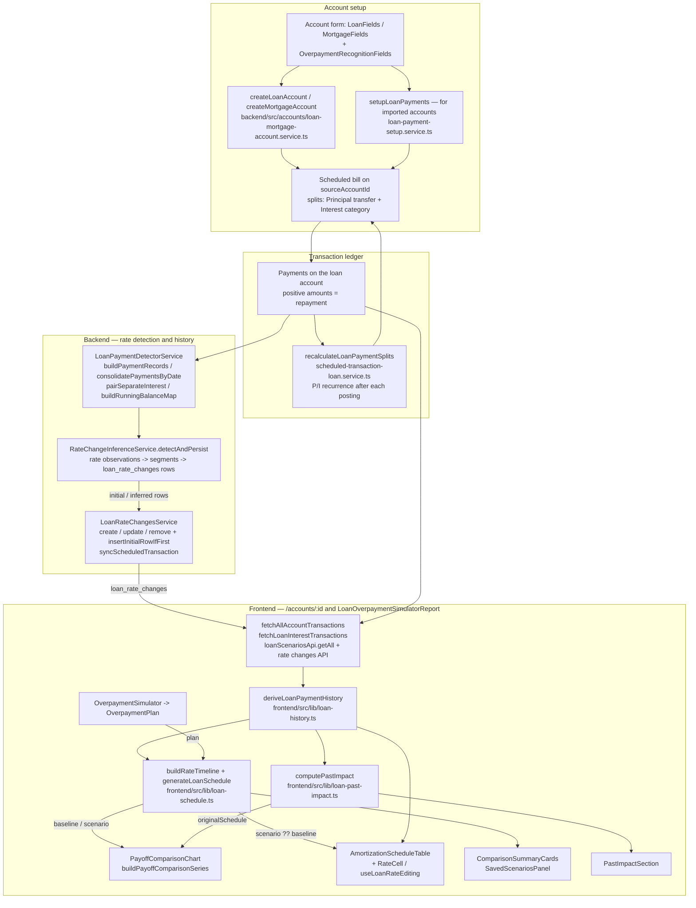
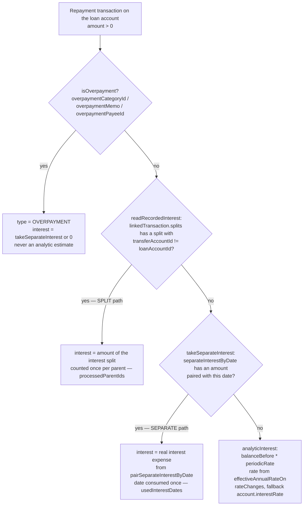
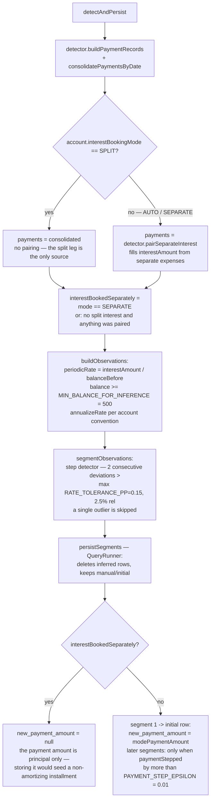
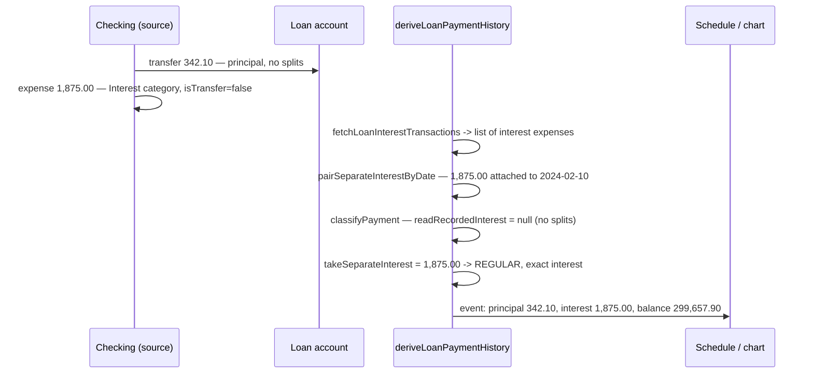
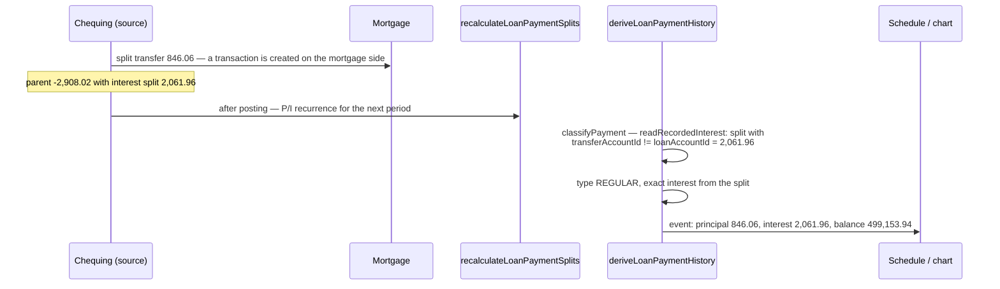
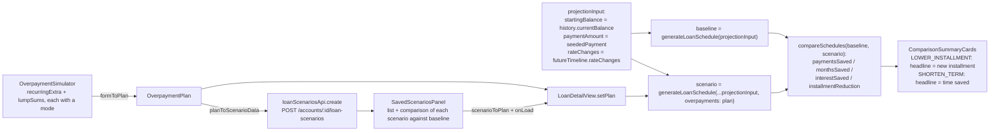
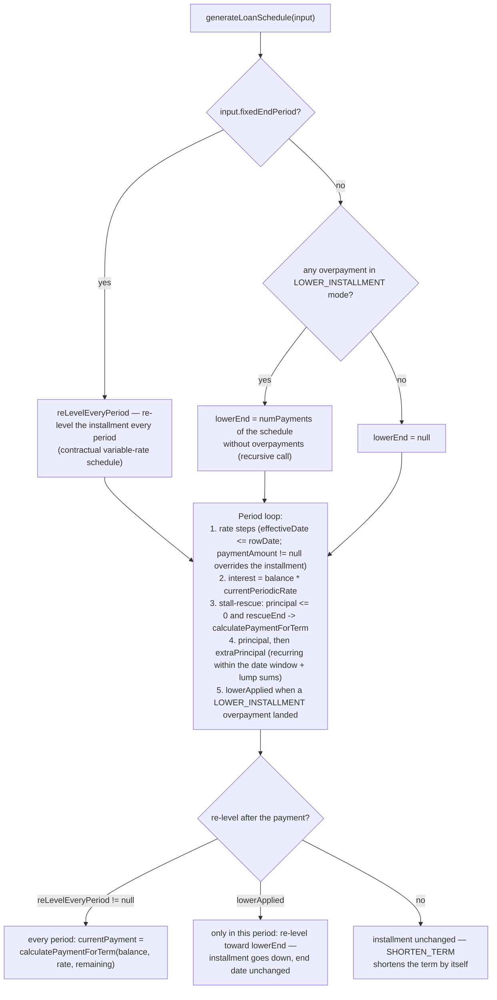
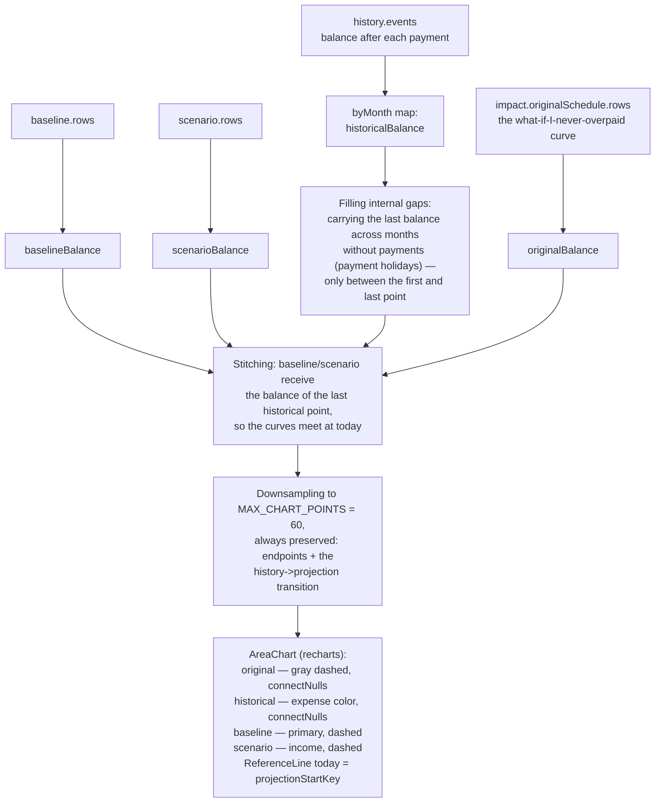
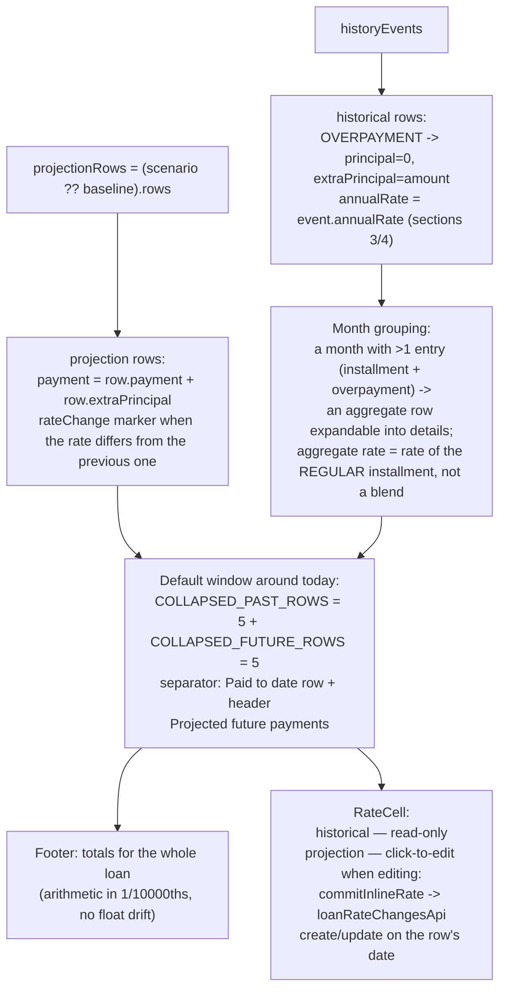

# Loans/mortgages in Monize — full logic flow (branch `feat/loan-overpayment-manual`)

*This document was generated to explain the logic of this PR and reflects the current state of the branch, including the latest fixes.*

The document follows the actual code (as on disk, including uncommitted changes in
`loan-history.ts` and `loan-schedule.ts` plus commits `99c75711` and `cc7ac073`): from
creating a loan account, through booking installments, backend rate detection, all the way
to the frontend derivation of payment history, the overpayment simulator, the payoff chart,
and the schedule table.

---

## 1. Overview

The whole journey "from zero": a person creates a LOAN/MORTGAGE account, books installments
(manually or via a scheduled bill), the backend can infer rate changes from the history, and
the frontend uses that to compute the payment history, projection, overpayment simulation,
and comparisons.



Frontend entry point: `frontend/src/app/accounts/[id]/page.tsx` loads the data and renders
`LoanDetailView` (`frontend/src/components/accounts/loan-detail/LoanDetailView.tsx`), which
is also the body of the `LoanOverpaymentSimulatorReport` — one implementation, two places.

---

## 2. Account setup

What a person sets and who reads it later. The fields live on the `Account` entity
(`backend/src/accounts/entities/account.entity.ts`) and are set in the account
create/edit form (`LoanFields.tsx` / `MortgageFields.tsx`, section
`OverpaymentRecognitionFields.tsx`).

| Field | Where it is set | Who consumes it |
|---|---|---|
| `interestRate` | form (required at creation) | `analyticInterest` (rate fallback), `effectiveAnnualRateOn` (fallback), `projectionInput` in `LoanDetailView`, `insertInitialRowIfFirst`, scheduled-bill splits |
| `paymentAmount` | LOAN: entered; MORTGAGE: computed by `calculateMortgageAmortization` | projection seed (fallback only — see `deriveCurrentInstallment`), `insertInitialRowIfFirst` (`newPaymentAmount` of the initial row) |
| `paymentFrequency` / `mortgagePaymentFrequency` | form | `getPeriodsPerYear` / `getMortgagePeriodsPerYear` everywhere (periodic interest, annualization, `advanceDate`) |
| `paymentStartDate` | form | `computePastImpact.startDate`, lower bound of `scopedInterestTransactions` in `deriveLoanPaymentHistory`, date of the `initial` row |
| `termMonths` | MortgageFields (years+months; cleared when non-Canadian) | `termEndDate`, `configuredTermMonths` fallback in `computePastImpact` |
| `amortizationMonths` | MortgageFields (required for MORTGAGE) | PMT (`calculateMortgageAmortization`, `calculateMortgagePaymentAmount`), `configuredTermMonths` (preferred over `termMonths`), `recalculatePaymentForRate` |
| `originalPrincipal` | `createMortgageAccount` sets = `abs(openingBalance)`; `setupLoanPayments` fills it in when missing | first choice of starting principal in `computePastImpact` |
| `openingBalance` | form (stored as negative: `-loanAmount`) | `deriveLoanPaymentHistory.startingBalance` (when set), `originalPrincipal` fallback |
| `isCanadianMortgage` | MortgageFields | `getPeriodicRate` (semi-annual compounding for fixed), `annualizeRate` in inference |
| `isVariableRate` | MortgageFields | same as above — a Canadian variable rate is computed like a regular one (monthly compounding) |
| `interestBookingMode` (`AUTO` / `SPLIT` / `SEPARATE`) | `OverpaymentRecognitionFields` (Select + `LoanBookingHelp`) | `RateChangeInferenceService.detectAndPersist` — decides interest pairing and `newPaymentAmount` (section 3) |
| `interestCategoryId` | `OverpaymentRecognitionFields` (Combobox); defaults to `findLoanCategories` at creation | the "Interest" split of the scheduled bill, `pairSeparateInterest` (backend), `fetchLoanInterestTransactions` (frontend) |
| `overpaymentCategoryId` / `overpaymentMemo` / `overpaymentPayeeId` | `OverpaymentRecognitionFields` | `isOverpayment` in `classifyPayment` — any single match suffices (category OR memo substring OR payee, on the transaction, its `linkedTransaction`, or the correlated split `correspondingParentSplit`) |
| `sourceAccountId` | form (required) | scheduled-bill account, scope of `pairSeparateInterest`, `fetchLoanInterestTransactions` |

Important: these fields feed **derived views only** (the schedule breakdown, past
impact, projection, rate detection) — never the account balances (see the comment in
`OverpaymentRecognitionFields.tsx`).

At account creation, `createLoanAccount` / `createMortgageAccount` additionally creates a
scheduled bill on `sourceAccountId` with splits:

```
splits: [
  { transferAccountId: <loan account>, amount: -principalPayment, memo: "Principal" },
  { categoryId: interestCategoryId,    amount: -interestPayment,  memo: "Interest"  },
]
```

and after each posting `ScheduledTransactionLoanService.recalculateLoanPaymentSplits`
recomputes the next split with the amortization recurrence
`next_interest = prev_interest - (prev_principal + extra) * periodicRate`
(with a balance × rate fallback) and deactivates the bill when the balance is <= 0.01.
`LoanPaymentSetupService.setupLoanPayments` does the same for already-existing
(imported) accounts, with an optional `"Extra Principal"` split.

---

## 3. Interest recognition — two paths

### 3.1 `interest_booking_mode`

The comment on the column in `account.entity.ts` defines the modes:

- **`AUTO`** — interest is read from the installment split if there is one; otherwise from a
  separate expense in the interest category (principal transfers never count as interest),
- **`SPLIT`** — interest is *exclusively* a categorized split of the installment,
- **`SEPARATE`** — interest is a standalone expense in the interest category; principal is a
  transfer to the loan account.

### 3.2 Frontend: the interest-resolution chain in `classifyPayment` (`loan-history.ts`)

For each positive transaction on the loan account:



The source for the SEPARATE path is `fetchLoanInterestTransactions(account)`: transactions in
`interestCategoryId` on `sourceAccountId`, filtered to
`tx.categoryId === account.interestCategoryId && !tx.isTransfer` — i.e. only *standalone*
expenses (a split's parent has `categoryId = null` at the transaction level, so split
interest does not land here a second time). `deriveLoanPaymentHistory` additionally narrows
them to the lifetime of this loan (`scopedInterestTransactions`: from
`paymentStartDate`/the first transaction, up to the last payment if the loan is paid off) —
protection against interest "leaking" between successive refinanced loans that share the
category and source account (commit `201130ad`).
`pairSeparateInterestByDate` attaches each expense to the nearest payment date within a
window of half the median interval (min. 15 days); unpaired expenses become *interest-only*
rows (grace period) — merged and recomputed in the `orphanInterest` block of
`deriveLoanPaymentHistory`.

### 3.3 Backend: rate detection vs. booking mode (`rate-change-inference.service.ts`)



This is the crux of the fork: **for SEPARATE, `loan_rate_changes` rows have
`new_payment_amount = null`**, because the observation's `payment.amount` is only the
principal transfer. **For SPLIT, `new_payment_amount` is the full installment** (the source
transaction amount, principal + interest), so the frontend `buildRateTimeline` receives a
`startingPaymentAmount`.

Addendum: manually adding a rate change (`LoanRateChangesService.create`) for the first
row triggers `insertInitialRowIfFirst`, which stores `newPaymentAmount =
account.paymentAmount` — for a SEPARATE loan that is often the principal-only amount. The
frontend defends against this with the guard `recordedInstallment > firstPeriodInterest`
(section 4.1), but it is worth keeping in mind.

---

## 4. Two example datasets — a walk through the whole pipeline

Both examples go through the identical pipeline; the only difference is how interest is
booked, and therefore the value of `new_payment_amount` in the rate history — and, further
downstream, every branch that depends on it.

### 4.1 The user's approach (SEPARATE) — a Polish mortgage

**Data:** loan of 300,000 PLN, rate 7.5% (variable, `isVariableRate = true`), `MONTHLY`,
`amortizationMonths = 300` (25 years), `paymentStartDate = 2024-01-10`,
`interestBookingMode = 'SEPARATE'`, `interestCategoryId` = "Loan interest",
`sourceAccountId` = checking account, `overpaymentMemo = "nadpłata"`. Bank installment
(annuity): ~2,217.10 PLN; periodic rate 7.5%/12 = 0.625%.

**Booking one period (2024-02-10):** two separate entries on the checking account:

1. a transfer of 342.10 PLN checking → loan account (principal; `isTransfer`, no splits),
2. an expense of 1,875.00 PLN in the "Loan interest" category (regular transaction, not a transfer).



**Overpayment (2024-06-20):** a transfer of 10,000 PLN with memo "nadpłata" →
`matchesOverpaymentMemo` hits → `type = OVERPAYMENT`, `interest = 0` (no interest
expense pairs with the 20th of the month; the June interest was consumed by the
installment of June 10). 100% principal; in the table it lands in the *Extra Principal*
column.

**Rate change (from 2024-09-10):** WIBOR drops, the bank charges 6.0%. Balance ~287,600 PLN →
interest expense ~1,438.00 PLN. The user keeps booking the same way as before.

**Rate detection (`detectAndPersist`):**

- `hadSplitInterest = false` (transfers without splits) → SEPARATE mode forces pairing
  anyway: `pairSeparateInterest` fills the `interestAmount` of every payment,
- observations: 1,875.00 / 300,000 = 0.00625 → ×12×100 = **7.50%** (months 1–7);
  1,438.00 / 287,600 = 0.005 → **6.00%** (from September),
- two segments → two `loan_rate_changes` rows:

| effectiveDate | annual_rate | new_payment_amount | source |
|---|---|---|---|
| 2024-02-10 | 7.50 | **null** | initial |
| 2024-09-10 | 6.00 | **null** | inferred |

`new_payment_amount = null` because `interestBookedSeparately = true` — the payment
amounts (342.10; 345…) are principal only.

**Frontend — consequences of the null installments:**

- `buildRateTimeline(rateChanges, startDate, interestRate)` →
  `startingAnnualRate = 7.5`, **`startingPaymentAmount = null`** (no row has a
  `newPaymentAmount`),
- `computePastImpact`: `recordedInstallment = null` → `useRecordedInstallment = false`
  → **PMT fallback**: `contractualPayment = calculateMortgagePaymentAmount(300000, 7.5,
  300, 'MONTHLY', …) ≈ 2,217.10`; `originalSchedule` is generated with
  `fixedEndPeriod = 300` (re-level every period — adjusts the installment at the step to
  6.0%) and with rate steps whose `paymentAmount` is zeroed out,
- `deriveCurrentInstallment(history, account.paymentAmount)`: the last REGULAR installment =
  principal + interest, e.g. 355 + 1,438 ≈ **1,793 PLN** — and this (not
  `account.paymentAmount`, which may be principal only) seeds the `projectionInput`
  projection in `LoanDetailView`
  (`seededPayment = futureTimeline.startingPaymentAmount ?? installment`, here `null ??
  installment`),
- **the Rate column in the schedule**: as long as no rate history exists (before
  detection), `assignObservedRates` reconstructs the rate from interest:
  `interest / balanceBefore * 365 / days * 100` — with day jitter (30 days → 7.60%; 31
  days → 7.36%), and stub rows (interest < `FULL_PERIOD_INTEREST_RATIO = 0.5` of the
  expected full period) show the scalar `account.interestRate`. **After detection**
  (once `rateChanges` rows exist) the table shows clean, discrete 7.50% / 6.00% from the
  timeline (`effectiveAnnualRateOn`); an overpayment always has `annualRate = null` (—).

### 4.2 The Canadian approach (SPLIT) — a mortgage with semi-annual compounding

**Data:** mortgage of 500,000 CAD, rate 5.0% fixed, `isCanadianMortgage = true`,
`isVariableRate = false`, `MONTHLY`, `amortizationMonths = 300`, `termMonths = 60`,
`interestBookingMode = 'SPLIT'`. Periodic rate (semi-annual compounding):
`(1 + 0.05/2)^(2/12) − 1 = 0.41239%`. Installment from `calculateMortgageAmortization` ≈
**2,908.02 CAD**; first split: interest 2,061.96, principal 846.06.

**Booking one period:** a single posted scheduled bill on the chequing account:

```
amount: -2,908.02
splits: [ transfer -846.06 -> mortgage (memo "Principal"),
          category Interest -2,061.96 (memo "Interest") ]
```

After posting, `recalculateLoanPaymentSplits` sets the next split via the recurrence:
`next_interest = 2,061.96 − 846.06 × 0.0041239 ≈ 2,058.47`, `next_principal = 849.55`.



**Renewal after 5 years (term):** balance ≈ 442,540 CAD; new rate 4.4%, the bank
re-levels the installment over the remaining 240 periods → ≈ **2,766.60 CAD** (interest ≈ 1,607.93).

**Rate detection:**

- `hadSplitInterest = true`; `SPLIT` mode → **`pairSeparateInterest` is skipped**
  (double counting ruled out), `interestBookedSeparately = false`,
- Canadian fixed annualization: `((1 + 0.0041239)^(12/2) − 1) × 2 × 100 = 5.00%`,
- rows:

| effectiveDate | annual_rate | new_payment_amount | source |
|---|---|---|---|
| 2024-02-01 | 5.00 | **2908.02** | initial |
| 2029-02-01 | 4.40 | **2766.60** (paymentStepped) | inferred |

**Frontend — consequences of full installments:**

- `buildRateTimeline` → `startingAnnualRate = 5.0`, **`startingPaymentAmount =
  2908.02`**, step `{ effectiveDate: 2029-02-01, annualRate: 4.4, paymentAmount:
  2766.60 }`,
- `computePastImpact`: `useRecordedInstallment = true` (2,908.02 > 2,061.96 of
  first-period interest) → **the contractual schedule follows the actually booked
  installment and its steps** (`rateChanges: timeline.rateChanges` with `paymentAmount`
  preserved), with `rescueEndPeriod = 300` — re-level only if a rate increase choked the
  installment below interest (it never forces payoff exactly on the term date, so a
  faster real payoff stays faster). This is the change from commit `99c75711`,
- current projection: `seededPayment = futureTimeline.startingPaymentAmount` (the last
  recorded installment, here 2,766.60 after renewal) — the guard `seededPayment >
  firstPeriodInterest` lets it through,
- **the Rate column**: rate history exists → discrete 5.00% until January 2029, then
  4.40% — no reconstruction and no day jitter.

### 4.3 Divergence summary

| Stage | SEPARATE (Polish) | SPLIT (Canadian) |
|---|---|---|
| `readRecordedInterest` | `null` (transfer without splits) | amount of the interest split |
| interest source in `classifyPayment` | `takeSeparateInterest` (pairing by date) | split recorded in the installment |
| `pairSeparateInterest` in inference | yes (forced) | skipped (SPLIT mode) |
| `new_payment_amount` of the rate row | `null` | full installment (segment mode / step) |
| `timeline.startingPaymentAmount` | `null` | 2,908.02 |
| `computePastImpact` branch | PMT over `configuredTermMonths` + `fixedEndPeriod` | real installment + steps + `rescueEndPeriod` |
| projection seed | `deriveCurrentInstallment` (principal+interest of the last installment) | `startingPaymentAmount` from the timeline |
| Rate column without rate history | reconstruction `interest/balance*365/days` or account scalar | (does not occur — detection provides the history) |
| Rate column with rate history | discrete rates from the timeline | discrete rates from the timeline |

---

## 5. Overpayment simulator

`OverpaymentSimulator.tsx` is a pure form: a recurring amount (with a date window) + up to 50
one-off amounts (`MAX_LUMP_SUMS`), each item with its own `ModeSelect`
(`SHORTEN_TERM` = shorten the term, `LOWER_INSTALLMENT` = lower the installment; default
`SHORTEN_TERM`). Every change → `formToPlan(form)` → `onPlanChange(plan)` →
`LoanDetailView.setPlan`. The "detected overpayment" hint comes from
`accountsApi.detectLoanPayments` (`LoanPaymentDetectorService.detectExtraPrincipal`:
memo "extra"/"additional" or a static split with CV < 2%).



How `generateLoanSchedule` applies the modes (per-overpayment, commit `22f1e586`):



`rescueEnd = fixedEndPeriod ?? rescueEndPeriod ?? lowerEnd` — the rescue against a "stall"
(installment < interest after a rate hike) works in all three configurations.
`calculatePaymentForTerm` is the annuity `A = B*r / (1 − (1+r)^(−n))` — exactly what a
bank computes when *lowering the installment*. The result carries `finalPaymentAmount`, from
which `compareSchedules` derives `installmentReduction` (0 for SHORTEN_TERM).

Saved scenarios: the `LoanScenario` entity
(`recurringExtraAmount/Mode/StartDate/EndDate`, `lumpSums[]`), CRUD in
`loan-scenarios.ts`; `LoanDetailView.scenarioComparisons` computes a comparison of each
saved scenario against the baseline without loading it into the form.

---

## 6. Chart and schedule

### 6.1 `PayoffComparisonChart` — four curves on one axis

`buildPayoffComparisonSeries(historyEvents, baseline, scenario, original)` stitches the
series monthly (key `yyyy-MM`, the last balance in the month wins):



The `originalBalance` curve is intentionally **not** stitched to the history — it overlays
the historical period so that the divergence "actual balance vs. contractual" is visible at
a glance (it is the visual counterpart of `PastImpactSection`: `extraPrincipalPaid`,
`monthsAlreadySaved`, `interestAlreadySaved`, all from the same `computePastImpact`).

### 6.2 `AmortizationScheduleTable` — history + projection in one table



The **Rate** column in historical rows is `LoanPaymentEvent.annualRate` from
`assignObservedRates`, that is:

- when `rateChanges.length > 0` — **the exact rate from the stored timeline** at the row's
  date (overpayments: `—`) — the main path after the changes in `99c75711`,
- when no rate history exists — a reconstruction from the accrued interest, annualized over
  the real day interval since the previous *interest* event (an overpayment without
  interest does not reset the accrual clock; a gap > 1.5 periods = a payment holiday →
  nominal period; a row with an interest "stub" < 50% of a full period → account scalar).

In projection rows the rate is editable inline (`useLoanRateEditing.commitInlineRate`):
editing on a date with an existing change updates it, on a new date it creates a
"rate-only" change (without `newPaymentAmount`) — with a preview/resync of the scheduled
bill handled by `LoanRateChangesService` (`deferScheduledSync` + `applyScheduledPaymentSync`).

---

## Appendix: files

| Layer | File | Role |
|---|---|---|
| BE | `backend/src/accounts/loan-mortgage-account.service.ts` | creation of LOAN/MORTGAGE accounts + scheduled bill, legacy `updateMortgageRate` |
| BE | `backend/src/accounts/loan-payment-setup.service.ts` | retrofits the scheduled bill for imported accounts |
| BE | `backend/src/accounts/loan-payment-detector.service.ts` | payment pattern detection, `pairSeparateInterest`, `buildRunningBalanceMap`, extra principal |
| BE | `backend/src/accounts/loan-amortization.util.ts` / `mortgage-amortization.util.ts` | PMT, periodic rates (Canadian semi-annual), P/I splits |
| BE | `backend/src/loan-rate-changes/rate-change-inference.service.ts` | rate segment inference, the `new_payment_amount` decision |
| BE | `backend/src/loan-rate-changes/loan-rate-changes.service.ts` | rate timeline CRUD, the `initial` row, scheduled-bill resync |
| BE | `backend/src/scheduled-transactions/scheduled-transaction-loan.service.ts` | P/I recurrence after posting |
| FE | `frontend/src/lib/loan-history.ts` | `deriveLoanPaymentHistory`, `classifyPayment`, `assignObservedRates`, `deriveCurrentInstallment`, `fetchLoanInterestTransactions` |
| FE | `frontend/src/lib/loan-schedule.ts` | `generateLoanSchedule`, `buildRateTimeline`, `effectiveAnnualRateOn`, `calculatePaymentForTerm`, `compareSchedules` |
| FE | `frontend/src/lib/loan-past-impact.ts` | `computePastImpact` — contractual baseline and savings |
| FE | `frontend/src/lib/loan-scenarios.ts` | scenarios API, `scenarioToPlan` / `planToScenarioData` |
| FE | `frontend/src/components/accounts/loan-detail/*` | `LoanDetailView`, `OverpaymentSimulator`, `PayoffComparisonChart`, `AmortizationScheduleTable`, `PastImpactSection`, `ComparisonSummaryCards`, `SavedScenariosPanel`, `RateCell`, `useLoanRateEditing` |
| FE | `frontend/src/components/accounts/OverpaymentRecognitionFields.tsx` | overpayment recognition fields + `interestBookingMode` in the account form |
